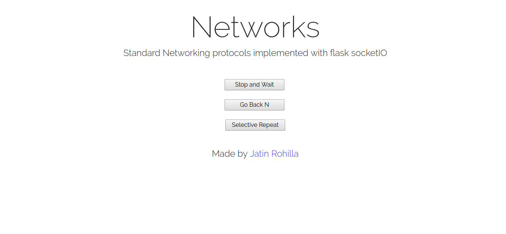

# mca204-networks

Standard Networking Protocols using [flask socketIO](https://github.com/miguelgrinberg/Flask-SocketIO)

For more details, refer the [detailed readme](./README-detailed.md)

## How to run

* git clone the repo and navigate to directory
* make sure you have pipenv installed, or run `brew install pipenv`
* type `pipenv shell` to activate the virtual environment
* install requirements from `requirements.txt` or pip lock file
* run `python app.py` and navigate to `localhost:5000` in browser
* disable debugging in `app.py` if you don't want messages in terminal
* The `master` branch contains merged app
* If you're interested in separate app for all three protocols, visit the [individual-release branch](https://github.com/jatin69/mca204-networks/tree/individual-release)

## How to deploy

* refer [heroku docs](https://devcenter.heroku.com/articles/getting-started-with-python#introduction) for more info
* `git add .` to stage everything
* `git status` to verify
* `git commit -m "Committing changes"`
* `git push`
* `heroku login`
* `heroku create <unique-app-name>`
* `git push heroku master`
* `heroku ps:scale web=1` to scale a dyno
* `heroku open` to see the app

## Screenshots

### Welcome Page

### Stop and Wait

### Go Back N

### Selective Repeat

