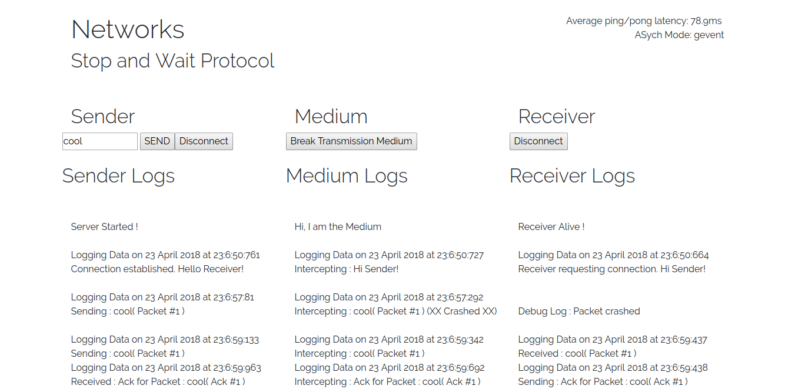
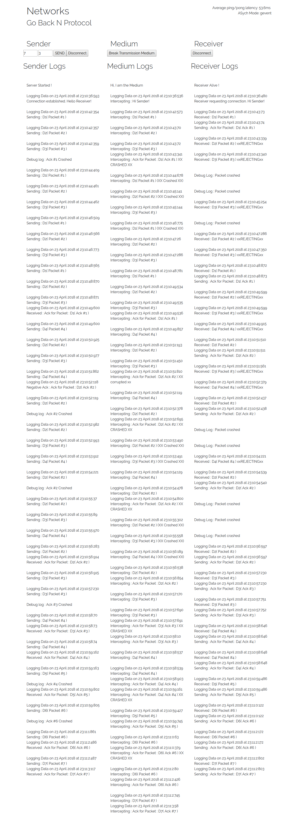
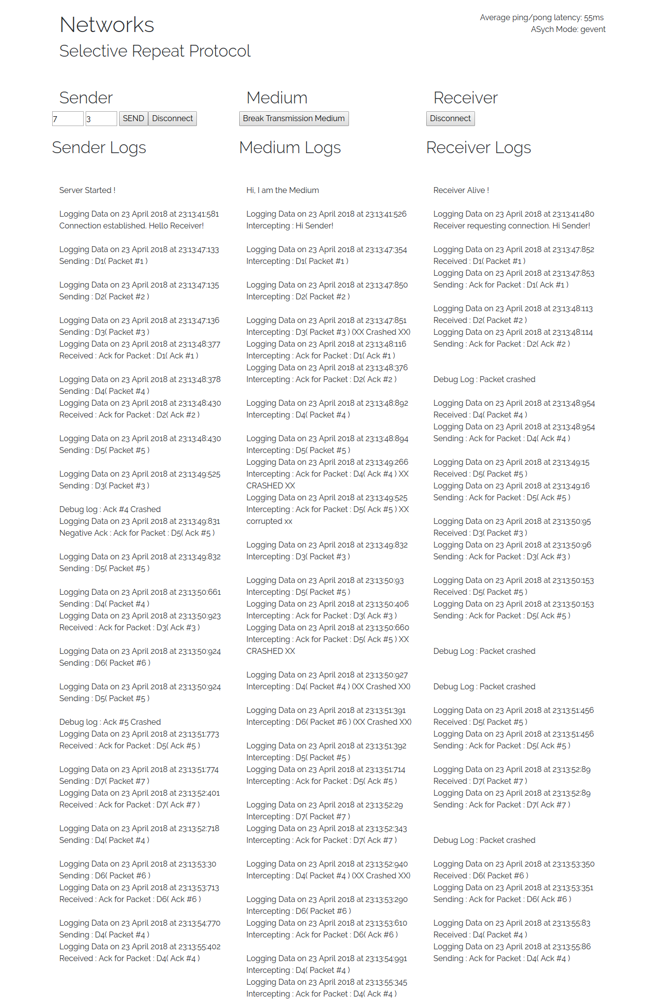

# mca204-networks

Standard Networking Protocols using [flask socketIO](https://github.com/miguelgrinberg/Flask-SocketIO/tree/master/example)

For more details, refer the [detailed readme](./README-detailed.md)

## How to run

* git clone the repo and navigate to directory
* make sure you have pipenv installed, or run `brew install pipenv`
* type `pipenv shell` to activate the virtual environment
* install requirements from `requirements.txt` or pip lock file
* run `python app.py` and navigate to `localhost:5000` in browser
* disable debugging in `app.py` if you don't want messages in terminal
* similarly, run `stop-and-wait.py`, `go-back-N.py`, and `selective-repeat.py`

## Screenshots

### Stop and Wait

### Go Back N

### Selective Repeat

